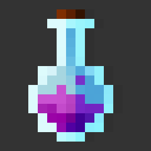

# Yotum

<br>
<div align='center'>



<a href="https://yotum.kruceo.com">📚 <strong>Example</strong></a> ╽
<a href="https://home.kruceo.com">🧒🏼 <strong>Author</strong></a> ╽
<a href="https://home.kruceo.com/donation">🎁 <strong>Donation</strong></a>
</div>
<br>
<br>

## **Introduction**

Yotum as created for generate automatic color palletes with js.
<br><br>
## **Technologies**

* Javascript

<br><br>
## **Installation**
```
npm install -g kruceo/yotum

```
<br><br>
## **Getting started**

### Creating color

```js
import Color from 'yotum'

const red = new Color('#f00')
const green = new Color('#0f08') //with alpha
const blue = new Color([0,0,255]) // with RGB

console.log(red.rgb)
console.log(green.rgba)
console.log(blue.hex)
```
output:
```js
[255,0,0]
[0,255,0,0.5]
#0000ff
```
<br><br>

## **Mixing**

### Brightness


```js
  const color = new Color('#ff8252')
  const darker = brightness(color,50) //50% of total bright
```

### Saturate


```js
  const color = new Color('#ff8252')
  const darker = saturate(color,50) //50% of saturation
```
<br><br>

## **Palletes**

### Additive [Comming soon]


```js
  const color = new Color('#ff8252')
  const pallete = additive(color,30,10) // => [...Color x 10]
```

### Difference Between [Comming soon]


```js
  const color1 = new Color('#ff8252')
  const color2 = new Color('#0022ff')
  const pallete = diffBetween(color1,color2,10) // => [...Color x 10]
```

### ***Square:***


```js
  const color = new Color('#ff8252')
  
  const pallete = square(color1,50) // => [...Color x 4]
```
<br><br>
## Author
Visit Kruceo website for more projects: <a href='https://home.kruceo.com'>home.kruceo.com