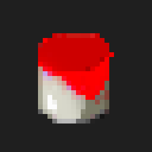

# Yotum

<br>
<div align='center'>



<a href="https://yotum.kruceo.com">📚 <strong>Example</strong></a> ╽
<a href="https://home.kruceo.com">🧒🏼 <strong>Author</strong></a> ╽
<a href="https://home.kruceo.com/donation">🎁 <strong>Donation</strong></a>
</div>
<br>
<br>

## **Introduction**

Yotum was created for generate automatic color palletes with js.
<br><br>
## **Technologies**

* Javascript

<br><br>
## **Installation**
```
npm install -g kruceo/yotum

```
<br><br>
## **Getting started**

### Creating color

```js
import Color from 'yotum'

const red = new Color('#f00')
const green = new Color('#0f08') // with alpha
const blue = new Color([0,0,255]) // with RGB

console.log(red.rgb)
console.log(green.rgba)
console.log(blue.hex)
```
output:
```js
[255,0,0]
[0,255,0,0.5]
#0000ff
```
<br><br>

## **Color Class**

### Input
The constructor accepts hex and rgb, both with alpha support.

### Internal color systems
* RGB
* Hex
* HSB

```js
const color = new Color('f00f')

console.log(color.rgb) // return [255,0,0]
console.log(color.rgba) // return [255,0,0,1]

console.log(color.hex) //return "ff0000"
console.log(color.hexAlpha) //return "ff0000f"

console.log(color.hsb)  //return { hue:0, brightness:100, saturation:100 }
console.log(color.hsba)  //return { hue:0, brightness:100, saturation:100, alpha:100 }
```

<br><br>
## **Mixing**

### Brightness


```js
  const color = new Color('#ff8252')
  const darker = brightness(color,50) //Color with 50% of original bright
```


### Saturation


```js
  const color = new Color('#ff8252')
  const saturated = saturation(color,50) //Color with 50% of original saturation
```

### Hue rotation


```js
  const color = new Color('#ff8252')
  const newColor = hue(color,130) //Color with 130° addition to hue rotation
```


### Geometric hue rotation ***(Experiment)***


```js
  const color = new Color('#f00')
  const newColor = geometricHue(color,90) //the rotation added is sync with color wheel.
```

### Invert


```js
  const color = new Color('#ff8252')
  const inverted = invert(color) //Inverse color of the original
```
<br><br>

## **Palletes**

### Additive


```js
  const color = new Color('#ff8252')
  const pallete = additive(color,25,5) // => [Color x 5]
```

### Difference Between


```js
  const color1 = new Color('#ff8252')
  const color2 = new Color('#0022ff')
  const pallete = diffBetween(color1,color2,10) // => [Color x 10]
```

### Square


```js
  const color = new Color('#ff8252')
  const pallete = square(color,8,25) // => [Color x 8]
```

### Triad


```js
  const color = new Color('#ff8252')
  const pallete = triad(color,4,25) // => [Color x 4]
```

### Analog


```js
  const color = new Color('#ff8252')
  const pallete = analog(color,30,8) // => [Color x 8]
```

### Division


```js
  const color = new Color('#ff8252')
  const pallete = division(color) // => [Color x 5]
```

### Double division


```js
  const color = new Color('#ff8252')
  const pallete = doubleDivision(color) // => [Color x 5]
```

### Shades


```js
  const color = new Color('#ff8252')
  const pallete = shades(color1,10,8) // => [Color x 8]
```

<br><br>
## Author
Visit Kruceo website for more projects: <a href='https://kruceo.com'>kruceo.com
